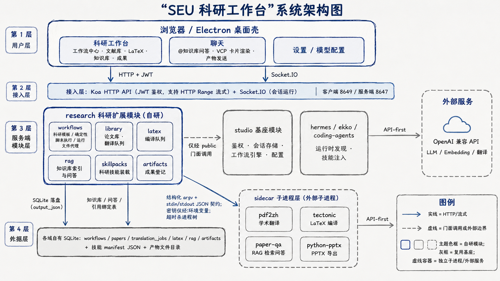

# SEU 科研工作台项目策划书

| 项目 | 内容 |
| --- | --- |
| 项目名称 | SEU 科研工作台（SEU Research Workbench） |
| 文档版本 | v1.0 |
| 编制日期 | 2026-09-03 |
| 文档性质 | 项目策划书（含一期总结与二期规划） |
| 基座依赖 | Hermes Studio（EKKOLearnAI/hermes-studio，BSL-1.1，非商业/科研用途可用） |
| 配套文档 | 《SEU 科研工作台设计方案》《用户手册》《模板编写指南》 |

---

## 1. 项目概述

### 1.1 项目名称与定位

本项目名称为 **SEU 科研工作台**（下称"本平台"），定位为面向科研人员的一站式本地科研作业平台。平台将文献管理、学术翻译、论文写作、科研绘图、知识库问答与可复现的科研工作流整合于统一的 Web 界面之下，使科研人员能够在单一环境内完成"文献获取 → 消化管理 → 知识问答 → 写作产出 → 成果沉淀"的完整科研闭环。

本平台在成熟的多 Agent 本地运行时基座（Hermes Studio）之上构建，继承其账号鉴权、多 Agent 会话、流程引擎与文件管理等基础能力，通过自主研发的"确定性工作流扩展、科研模板体系、论文工作台与知识库 RAG"等模块，将通用 Agent 控制台改造为面向科研场景的专用工作台。

### 1.2 背景与问题

当前科研工作流普遍存在以下痛点：

1. **工具碎片化**：文献阅读（PDF 阅读器）、翻译（在线翻译服务）、写作（LaTeX 编辑器/Word）、绘图（绘图脚本与办公软件）、知识管理（笔记软件）分散于多个独立工具，资料与上下文在工具间反复搬运，效率低下且易丢失。
2. **智能化流程沉淀不足**：大语言模型在科研中的使用多为"对话式即用即弃"，缺乏将成熟科研方法（文献综述方法、审稿式自查、完整性核查等）固化为可重复执行流程的载体，导致同样的工作每次都要重新口头描述。
3. **过程不可复现**：依赖模型自由发挥的科研辅助过程缺少确定性的中间产物（校验、聚合、报告生成），结果难以复核与复现。
4. **数据与隐私顾虑**：科研文献与数据上传公有云服务存在泄露风险，科研场景需要本地化、可自持的部署形态。
5. **翻译与写作质量瓶颈**：学术 PDF 翻译需保留公式、图表与排版；LaTeX 写作需要低摩擦的编译与错误定位体验；这些在通用工具链中长期缺乏良好解法。

### 1.3 建设目标

**总体目标**：建成一个本地部署、可复现、安全可控的一站式科研工作台，使科研人员以统一的界面完成文献管理、学术翻译、论文写作、知识问答与流程化科研作业。

**分期目标**：

| 阶段 | 目标 | 状态 |
| --- | --- | --- |
| 一期（已完成） | 建成科研工作台五大功能模块（工作流中心、文献库、LaTeX 写作、知识库、成果）与四大科研模板；确定性工作流引擎扩展上线；聊天协同（@知识库问答、产物发送、卡片渲染）成型；通过全部阶段评审与回归验证 | ✅ 已交付 |
| 二期（规划） | 完成科研 skill 库的深度融入（原版资产装载、主线模板补全、绘图自检闭环、审计检查节点）；真实模型端点的生产验证；打包分发与多机部署 | 📋 规划 |

**一期可量化成果**：

- 科研功能页面 5 个，科研模板 4 个，可绑定科研技能 5 个；
- 服务端研究域自动化用例 200+，客户端自动化用例 1600+，端到端场景 139 个，全部通过；
- 4 条外部能力真实链路（学术翻译、LaTeX 编译、RAG 问答、PPTX 导出）在本机完成端到端实测；
- 基座改动全部登记备案（BC-1~12），保持与上游的可同步能力。

### 1.4 设计原则

1. **复用优先**：工作流引擎、会话与鉴权、文件管理等复用成熟基座能力，自研部分聚焦科研场景扩展，降低维护成本。
2. **确定性优先**：凡可固化为脚本的环节（数据校验、聚合、报告生成、文件处理）一律采用确定性节点执行并落盘输出；大模型只出现在需要理解与写作的环节，二者在流程图中显式分层。
3. **API-first**：翻译、向量化、问答等智能能力一律通过 OpenAI 兼容 API 接入，不在本地下载或运行模型权重，兼顾质量、成本与合规。
4. **安全边界内建**：子进程按参数数组调用并强制进程树终止与输出上限；文件访问限定白名单根目录并做规范化校验；模型提供的 HTML/SVG 一律在无同源权限的沙箱中渲染；密钥仅经环境变量传递。
5. **上游可同步**：凡触及基座同源代码的改动一律登记备案（BC-1~12），保持改动附加式、向后兼容，确保后续可持续合并上游更新。

---

## 2. 建设内容与功能规划

### 2.1 功能总览

平台前端以"科研工作台"为一级入口，下设五个页签，并以聊天会话作为贯穿各模块的协同载体：

| 模块 | 页面 | 核心能力 |
| --- | --- | --- |
| 工作流中心 | 工作流页签 | 科研模板库（一键建流）、我的流程管理、可视化画布（深链）、技能装载 |
| 文献库 | 文献页签 | PDF 导入、元数据管理、流式预览、发送到聊天 |
| 学术翻译 | 随文献模块 | pdf2zh 翻译队列、双语对照预览、失败重试 |
| 论文写作 | LaTeX 页签 | 语法高亮编辑、tectonic 编译、错误定位、实时预览 |
| 知识库 | 知识库页签 | 建库、成员管理、索引、带引用问答 |
| 成果 | 成果页签 | 产物登记、预览、发送到聊天 |
| 聊天协同 | 聊天 | @知识库问答（引用溯源）、VCP 卡片渲染、产物接收、完成通知 |
| 模型配置 | 设置 | 模型与提供商配置、显示与通知偏好 |

### 2.2 科研模板体系

模板是本平台将科研方法固化的核心载体。一期交付四个模板，覆盖四类高频科研场景：

| 模板 | 科研场景 | 流程结构（A=智能节点，S=确定性节点） | 产物 |
| --- | --- | --- | --- |
| 文献综述 literature-review | 课题文献调研 | 检索(S) → 筛选(S) → 精读(A) → 综述初稿(A，绑综述提纲技能) → 引用核查(S) → HTML 报告(S) | 综述报告（含引用） |
| 论文翻译 paper-translate | 外文文献阅读 | PDF 接入校验(S) → 翻译(S，调 pdf2zh) → 双语对照页(S) | 译文 PDF + 双语对照页 |
| 过夜科研 overnight-research | 批量文献/实验的夜间处理 | 队列接入(S，校验去重分批) → 批处理(A) → 逐批聚合(S) → 下一步建议(A，绑审稿自查技能) → 晨报(S) | 晨报 HTML（统计/逐项/失败原因/建议） |
| 科研绘图 figure-drawing | 论文图表制作 | 需求校验(S) → 绘图(A，绑绘图规范技能) → 渲染(S) → PPTX 导出(S，可选) | figure.svg / figure.pptx |

上述结构体现了"**确定性为主、智能为辅**"的设计：队列解析、校验去重、聚合对账、报告渲染、文件导出等环节全部由确定性脚本完成（可复现、可中断续跑、失败可见），大模型仅承担理解与写作。

**二期模板规划**：论文结构规划、写作质量检查、AI 痕迹自查、完整性（integrity gate）核查节点等，源自 academic-research-skills 主线方法论。

### 2.3 科研技能体系

平台内置科研技能包机制，将科研方法论以技能（SKILL.md）形式装载到智能节点可用目录，实现"方法随模板走"：

- 一期内置 5 个技能：论文精读、图表规范、文献综述提纲、审稿式自查、科研绘图规范；
- 技能具备完整的生命周期管理（已装载/需更新/已修改/冲突/缺失五态），用户改动受保护，冲突目录永不被覆盖；
- 模板与技能通过声明式绑定关联，创建流程时自动装载所需技能；未装载时运行前置检查将明确拒绝并给出处理指引。

二期规划将引入原版开源科研技能库资产，扩充可调用技能至 19 个以上。

---

## 3. 技术路线

本平台采用 TypeScript 单体仓库（monorepo）形态，前后端同仓演进。系统总体架构如下图所示（分层说明详见《SEU 科研工作台设计方案》第 2 章）：

- **前端**：Vue 3（Composition API / `<script setup>`）+ Naive UI + Pinia + Vue Flow（流程画布）+ highlight.js/mermaid/KaTeX（渲染）；
- **后端**：Node.js（≥23）+ Koa + Socket.IO + SQLite（node:sqlite），按业务域划分为 studio（基座能力）、research（科研扩展）、hermes、ekko、coding-agents 五个模块，模块间仅允许经公共门面调用；
- **外部能力（sidecar）**：学术翻译（pdf2zh）、RAG 问答（paper-qa）、LaTeX 编译（tectonic）、PPTX 导出（python-pptx），统一以"结构化参数 + stdin/stdout JSON 契约 + 环境变量注入密钥"的 sidecar 协议接入，版本适配收敛于包装层；
- **桌面分发**：基座自带 Electron 打包与捆绑运行时能力，二期启用。

详细架构、模块设计与安全设计见《SEU 科研工作台设计方案》。

---

## 4. 实施计划与里程碑

一期按阶段推进，每阶段设独立评审门（阶段评审 + 大阶段评审），全部通过后方可进入下一阶段：

| 阶段 | 内容 | 里程碑 | 状态 |
| --- | --- | --- | --- |
| P0 地基 | 环境修正、依赖安装、基线构建与冒烟、仓库治理 | 构建/冒烟双绿，初始提交推送 | ✅ |
| P1 骨架 | 服务端科研模块骨架、前端五视图壳层、产物注册表 API | 骨架评审通过 | ✅ |
| P2 确定性工作流 | 引擎确定性节点扩展、存储列、画布节点、模板体系、过夜科研 | 阶段评审（外部）放行 | ✅ |
| P2R 评审修复 | 引擎生命周期加固、客户端契约修复 | 阻断项复审放行 | ✅ |
| P3 论文工作台 | 文献库与流式预览、pdf2zh 翻译队列、LaTeX 编辑与编译 | 阶段评审通过（真实链路打通） | ✅ |
| P4 智能协同 | RAG 知识库、聊天 @知识库、VCP 渲染、技能装载与绘图 | 阶段评审通过（真实链路打通） | ✅ |
| P5 打磨交付 | 端到端自动化、运行通知、用户手册与模板指南 | 全量回归绿，文档交付 | ✅ |
| P6/P7/P8 工程打磨 | 审查观察项清理、用户可感知限制清零、骨架页清零 | 打磨批回归绿 | ✅ |
| P9/P10 产品化 | 品牌重塑（SEU 科研工作台）、导航瘦身、模板技能自动装载 | 产品化批回归绿 | ✅ |

**二期规划里程碑**（建议）：

| 阶段 | 内容 | 预估 |
| --- | --- | --- |
| 二期 M1 | 科研技能库深度融入：原版技能资产装载、主线模板补全（写作质量检查/AI 痕迹自查/完整性核查）、绘图自检修正闭环 | 2~3 周 |
| 二期 M2 | 真实生产端点验证（OpenAI 兼容密钥下的翻译与问答）、性能与大数据量场景调优（RAG 落盘索引、产物回收策略） | 1~2 周 |
| 二期 M3 | 桌面端打包分发（Electron 安装包）、多机部署文档、用户培训 | 1~2 周 |

---

## 5. 质量保障与验收标准

### 5.1 质量保障体系

1. **自动化测试**：研究域服务端用例 200+、客户端用例 1670+、Playwright 端到端场景 139 个；外部能力真实链路以环境门控用例单独覆盖（默认跳过、配置后可复跑）。
2. **多级评审**：每张工单独立评审（实现逐行核对 + 测试复跑），每个大阶段设外部评审门；一期累计关闭 12 项评审发现的问题（含 4 项阻断级）。
3. **变更治理**：基座同源改动逐条登记（BC-1~12），评审按表核验，保证上游可同步。
4. **回归门禁**：每次合并在主分支执行"服务端研究域 + 客户端全量 + 端到端 + 模块边界 + 构建五项回归"，全绿方可推送。

### 5.2 验收标准（一期，已达成）

- [x] 五大功能模块全部可用，无骨架占位页；
- [x] 四个科研模板经真实引擎端到端跑通，产物落盘且内容验收；
- [x] 学术翻译、LaTeX 编译、知识库问答、PPTX 导出四条真实链路实测通过；
- [x] 运行停止可及时中止脚本进程树（含 Windows），rerun 具备并发防护；
- [x] 全部自动化测试与端到端场景通过，构建与边界检查通过；
- [x] 用户手册（中文）与模板编写指南交付。

### 5.3 二期验收标准（规划）

- 原版科研技能资产可装载并被智能节点调用，主线补全模板经真实引擎跑通；
- 在真实模型端点密钥环境下，翻译与问答的端到端用例通过；
- 桌面安装包在干净环境安装即用，文档覆盖安装、配置、使用、模板编写。

---

## 6. 风险分析与应对

| 风险类别 | 描述 | 等级 | 应对措施 |
| --- | --- | --- | --- |
| 合规风险 | 基座为 BSL-1.1 许可（非商业/科研用途可用，2029-05 转 Apache-2.0） | 中 | 限定科研用途使用；改动登记保持来源可溯；关注许可转换节点 |
| 模型服务依赖 | 翻译/问答质量与可用性依赖外部 API 服务商 | 中 | API-first 抽象层支持任意 OpenAI 兼容端点；错误显式可见；无密钥时功能明确降级 |
| 网络环境 | 模型布局文件与依赖下载受网络环境限制 | 中 | 已验证国内镜像方案（pip 清华镜像、HF_ENDPOINT 镜像）并写入文档 |
| 子进程安全 | 确定性脚本与 sidecar 涉及子进程执行 | 高→已缓解 | 结构化参数、进程树强制终止、输出上限、路径白名单、退出兜底，均有测试钉住 |
| 前端注入 | 模型输出含 HTML/SVG 时存在注入面 | 高→已缓解 | 沙箱 iframe（无同源权限）、转义与程序化属性赋值、SVG 全隔离，断言测试覆盖 |
| 上游演进 | 基座持续更新可能与本地改动冲突 | 中 | 改动登记 + 附加式约束；导航裁剪等深度定制项在登记表中明示重放策略 |

---

## 7. 预期成果与交付物

**一期已交付**：

1. 平台源代码（含科研扩展模块与全部自动化测试），托管于项目仓库并同步远端；
2. 基座改动登记表（BC-1~12）、阶段评审报告、外部能力验证报告（spike）共 5 份；
3. 《用户手册》（中文，13 章）与《模板编写指南》（9 节）；
4. 《SEU 科研工作台设计方案》（本文档姊妹篇）。

**二期规划交付**：科研技能库深度融入后的模板体系、真实端点验证报告、桌面安装包与部署文档。

---

## 8. 术语表

| 术语 | 含义 |
| --- | --- |
| 确定性节点 | 由引擎直接执行脚本并落盘输出的流程节点，不创建会话，结果可复现 |
| 智能节点（Agent 节点） | 委托大模型完成理解与写作的流程节点，可绑定科研技能 |
| 模板 | 预定义的流程节点 DAG 与契约，经校验后一键实例化为可运行流程 |
| sidecar | 以独立子进程形态提供外部能力（翻译/编译/问答）的服务程序 |
| 技能（Skill） | 以 SKILL.md 描述的科研方法论资产，装载后可被智能节点注入使用 |
| VCP 卡片 | 聊天消息中 HTML/SVG/Mermaid/KaTeX 内容的沙箱化富渲染卡片 |
| BC 登记 | 对基座同源代码改动的备案机制，保障与上游仓库的可同步性 |

---

*本文档为 SEU 科研工作台项目的正式策划文件，与《SEU 科研工作台设计方案》配套使用。文档内容与代码仓库实际状态保持同步，重大变更须经项目评审后修订。*
